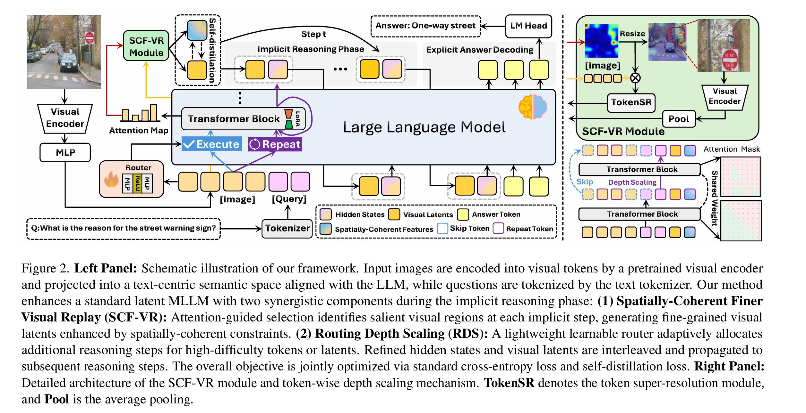
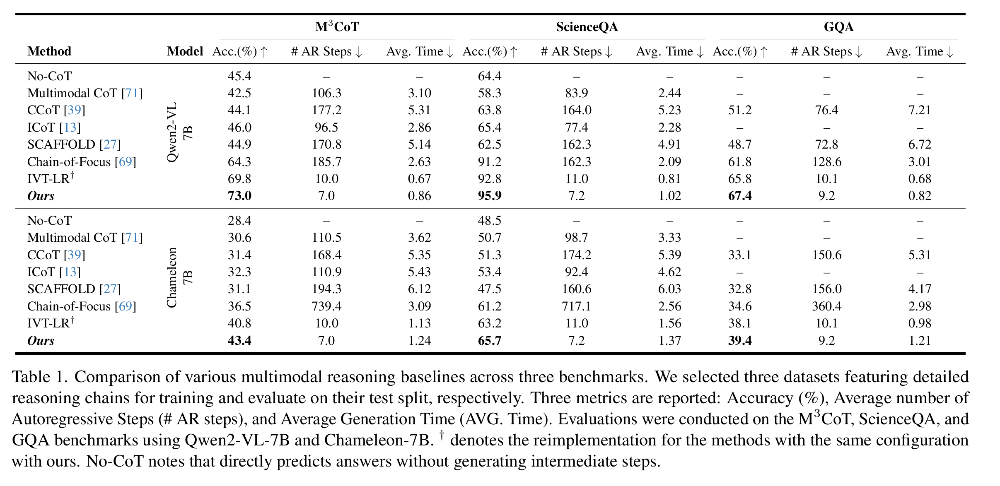
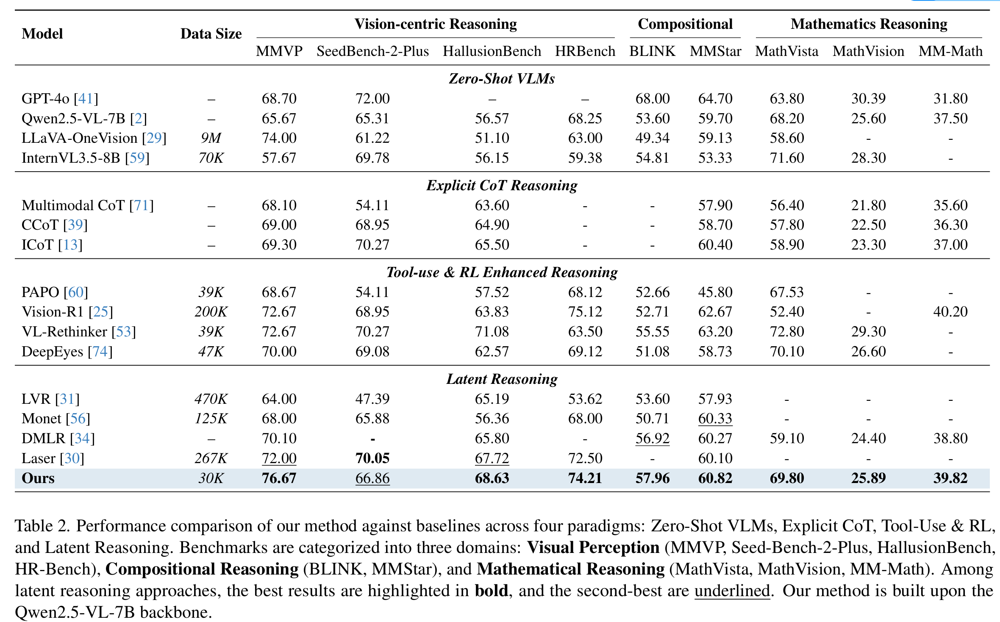

<a name="readme-top"></a>

<div align="center">
  <h1 align="center">Visual Enhanced Depth Scaling for Multimodal Latent Reasoning
</div>

<div align="center">

<!-- Paper Link -->

<a href="https://arxiv.org/abs/2604.10500">
    
  </a>

<!-- HuggingFace Models -->

<a href="https://huggingface.co/Hechiro/VEGAS_7B">
    
  </a>

<a href="">
    
  </a>

</div>


We propose a visual replay module and routing depth scaling to collaboratively enhance visual perception and refine complicated latents for deeper contextual reasoning. The former module leverages causal self-attention to estimate token saliency, reinforcing fine-grained grounding through spatially-coherent constraints. Complementarily, the latter mechanism adaptively allocates additional reasoning steps to complex tokens, enabling deeper contextual refinement.

<div align="center">
  <figure>
    
    <br>
    <figcaption><em>Quick Overview of Our Vedas.</em></figcaption>
  </figure>
</div>


## 🔥 News

<div style="max-height: 240px; overflow-y: auto;">

- **[2026.04]** 🎉🎉Initial release of Training Code and Inference Code.

</div>


## 📑 Table of Contents <span id="table-of-contents"></span>

* [🚀 Quick Start](#quick-start)
  * [Installation](#installation)
  * [Data Preparation](#data)
  * [Training](#training)
    * [Qwen2-VL](#qwen2-vl)
    * [Qwen2.5-VL](#qwen2.5-vl)
    * [Chameleon](#chameleon)
    * [Training Arguments](#arguments)
  * [Inference](#inference)
* [🔗 Related Projects](#related)
* [📚 Citation](#citation)


## 🚀 Quick Start <span id="quick-start"></span>

### 1. Installation <span id="installation"></span>

Clone repo:

```
git clone https://github.com/Simon98-AI/Vedas.git
cd Vedas
pip install -r requirements.txt
```

Setup environment:

```
conda create -n vedas python=3.10 
conda activate vedas
```

Expected folder structure

```plaintext
Vedas/
  ├── chameleon
        ├── args/
        ├── chameleon_dataset.py
        ├── ...
  ├── qwen_vl
        ├── args/
        ├── custom_dataset.py
        ├── ...
  └── requirements.txt
```

### 2. Data Preparation <span id="data"></span>

Download datasets:

```
dataset = load_dataset("LightChen2333/M3CoT")
dataset = load_dataset("derek-thomas/ScienceQA")
```

or download manually from:

* [M3CoT](https://huggingface.co/datasets/LightChen2333/M3CoT)
* [ScienceQA](https://huggingface.co/datasets/derek-thomas/ScienceQA)
* [OneThinker](https://huggingface.co/datasets/OneThink/OneThinker-train-data)


### 3. Training <span id="training"></span>

> **💡 Skip Training:** If you want to skip training and directly run inference, you can download our pretrained models from the [Vedas Collection]() on Hugging Face.

#### Qwen2-VL <span id="qwen2-vl"></span>

To train the Qwen2-VL model on M3CoT, SciceneQA, and GQA:

```
cd qwen_vl
export CUDA_VISIBLE_DEVICES=0,1,2,3,4,5,6,7
export WANDB_MODE=disabled

deepspeed --master_port 29505 qwenvl_run.py ./qwen_vl/args/qwen.yaml \
  --deepspeed \
  --deepspeed_config ds_config.json \
  --collect_grad False \
  --use_data_flag full \
  --progressive False \
  --ratio 1.0 \
  --use_tokensr True \
  --pattern 32_patch \
  --model_version v_2

```

#### Arguments

Key parameters in configuration:

- `save_path`: Checkpoint save directory
- `progressive`: If use curriculum training strategy (default: True)
- `collect_grad`: If investigate the gradient dynamics (default: False)
- `ratio`: Weight for self-distillation loss (default: 1.0)
- `use_tokensr`: If use self-distillation loss (default: True)
- `epochs_per_stage`: Epochs per latent reasoning stage (default: 4)
- `max_latent_stage`: Maximum latent reasoning stages (default: 5)
- `resume`: Resume epoch number (default: 0)
- `train_micro_batch_size_per_gpu`: Batch_size per GPU (default: 8)
- `batch_size_training`: Totally batch_size (default: 256)
- `gradient_accumulation_steps`: Gradient accumulation steps (default: 4)
- `num_epochs`: Total training epochs (default: 16)
- `lr`: Learning rate (default: 4e-5)
- `pattern`: The stategy of using visual latents (default: 32_patch)

#### Qwen2.5-VL <span id="qwen2.5-vl"></span>

To train the Qwen2-VL model on OneThinker:

```
cd qwen_vl
export CUDA_VISIBLE_DEVICES=0,1,2,3,4,5,6,7
export WANDB_MODE=disabled

deepspeed --master_port 29505 qwenvl_run.py ./qwen_vl/args/qwen.yaml \
  --deepspeed \
  --deepspeed_config ds_config.json \
  --collect_grad False \
  --use_data_flag full \
  --progressive True \
  --ratio 0.5 \
  --use_tokensr True \
  --pattern 32_patch \
  --model_version v_2_5
```

#### Arguments

Key parameters in configuration:

- `save_path`: Checkpoint save directory
- `collect_grad`: If investigate the gradient dynamics (default: False)
- `ratio`: Weight for self-distillation loss (default: 0.5)
- `use_tokensr`: If use self-distillation loss (default: True)
- `progressive`: If use curriculum training strategy (default: True)
- `epochs_per_stage`: Epochs per latent reasoning stage (default: 4)
- `max_latent_stage`: Maximum latent reasoning stages (default: 5)
- `resume`: Resume epoch number (default: 0)
- `train_micro_batch_size_per_gpu`: Batch_size per GPU (default: 2)
- `batch_size_training`: Totally batch_size (default: 64)
- `gradient_accumulation_steps`: Gradient accumulation steps (default: 4)
- `num_epochs`: Total training epochs (default: 4)
- `lr`: Learning rate (default: 4e-5)
- `pattern`: The stategy of using visual latents (default: 32_patch)


### 4. Inference <span id="inference"></span>

To generate the answer on the test split, run the inference code.

Qwen2-VL on M3CoT:

```
bash infer_{data_name}.sh
```

### 5. Experiment Results

<div align="center">
  <figure>
    
    <br>
    <figcaption><em>Results on three CoT Benchmarks.</em></figcaption>
  </figure>
</div>

<div align="center">
  <figure>
    
    <br>
    <figcaption><em>Results on various Multimodal Benchmarks.</em></figcaption>
  </figure>
</div>


## Acknowledgement
We would like to thank the following repos for their great work:

- This work is built upon the [CoCoNut](https://github.com/facebookresearch/coconut) and [IVT-LR](https://github.com/FYYDCC/IVT-LR).

## 🔗 **Related Projects** <span id="related"></span>

### 📄 Related Papers

- **[Coconut: Training Large Language Models to Reason in a Continuous Latent Space](https://arxiv.org/abs/2412.06769)**  
  A pioneering work on latent reasoning that uses continuous thought representations for LLM reasoning.

- **[Reasoning Within the Mind: Dynamic Multimodal Interleaving in Latent Space](https://arxiv.org/abs/2512.12623)**   
  A pioneering work on latent reasoning that uses visual latent for enhanced MLLM reasoning.

### 🌟 Awesome Collections

- **[Awesome Latent Space](https://github.com/YU-deep/Awesome-Latent-Space)**  
  A curated collection of resources on latent space methods and applications.

- **[Awesome Latent CoT](https://github.com/EIT-NLP/Awesome-Latent-CoT)**  
  A comprehensive list of latent chain-of-thought reasoning resources.


## 📚 **Citation** <span id="citation"></span>

If you use **Vedas** in your research or applications, please consider citing:

```bibtex
@article{han2026vedas,
  title={Visual Enhanced Depth Scaling for Multimodal Latent Reasoning},
  author={Yudong Han, Yong Wang, Zaiquan Yang, Zhen Qu, Liyuan Pan, Xiangxiang Chu},
  journal={arXiv},
  year={2025}
}
```


<br/>
⭐ <b>Thank you for visiting our Vedas!</b> ⭐

</div>
